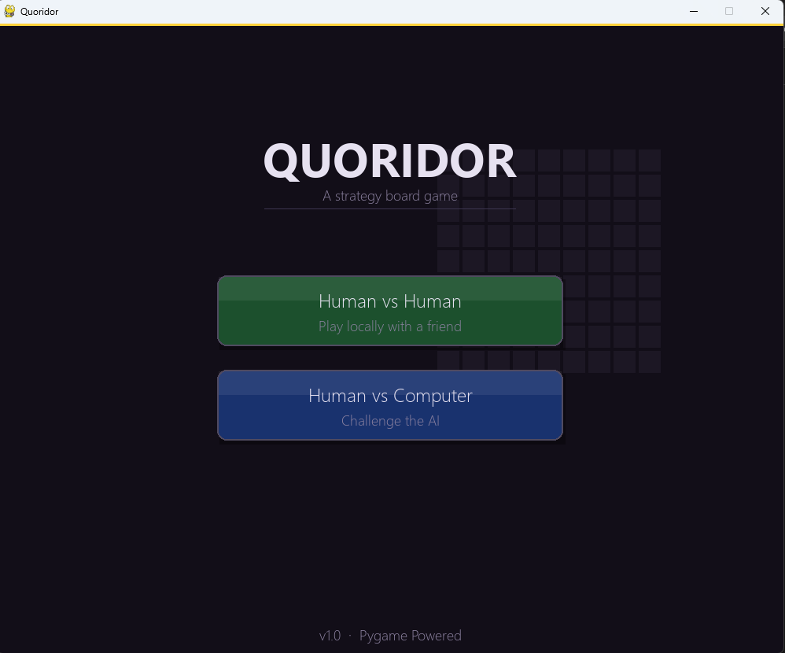
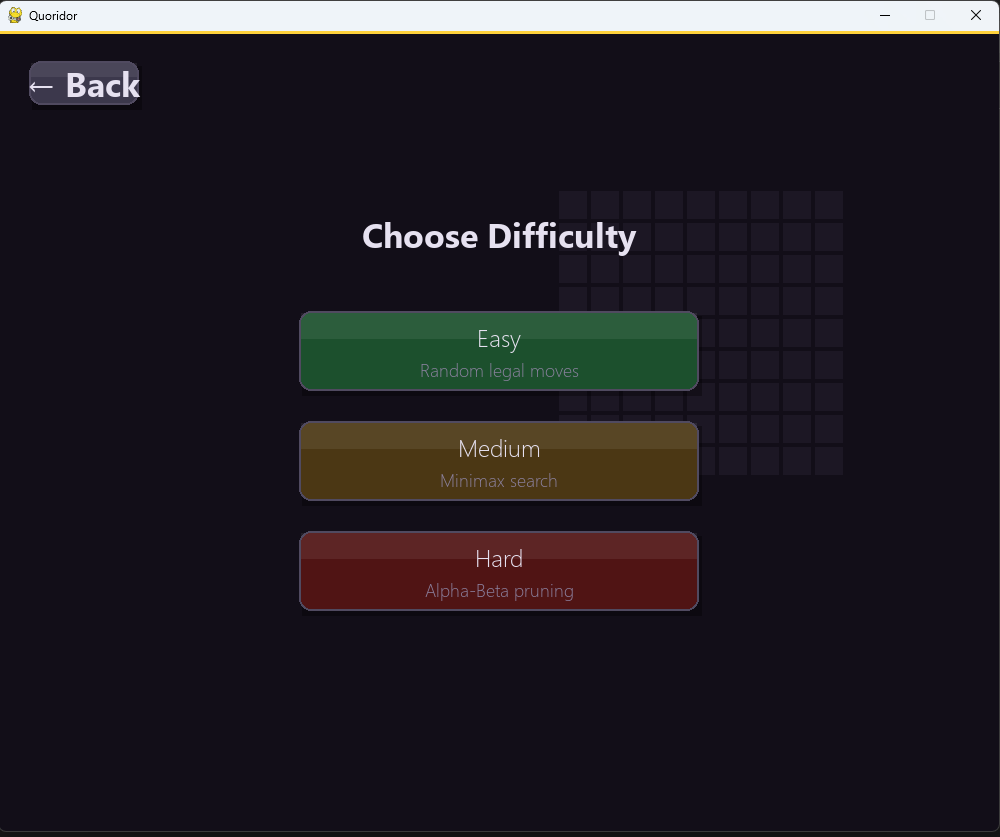
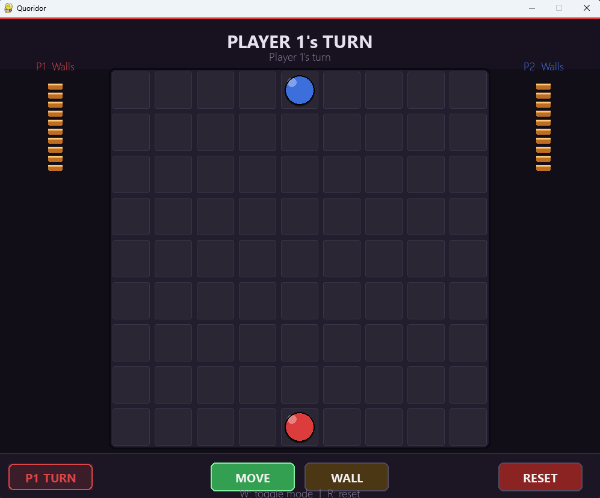
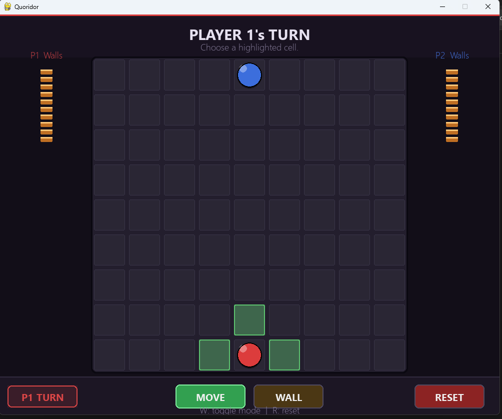
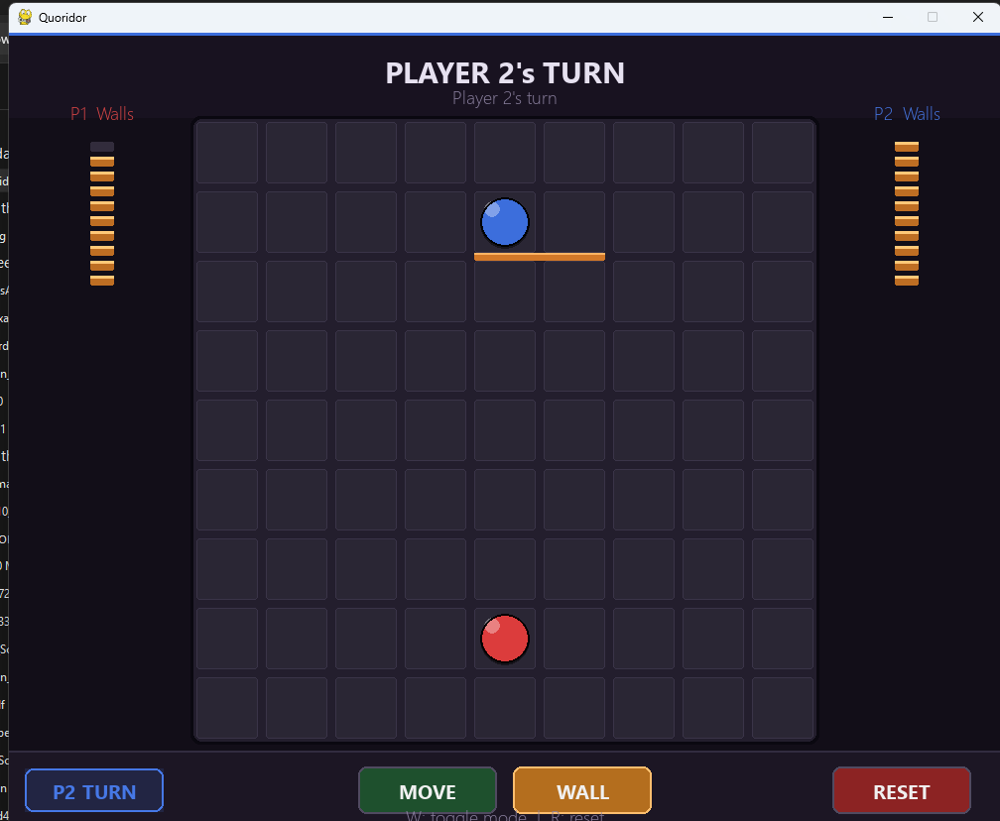
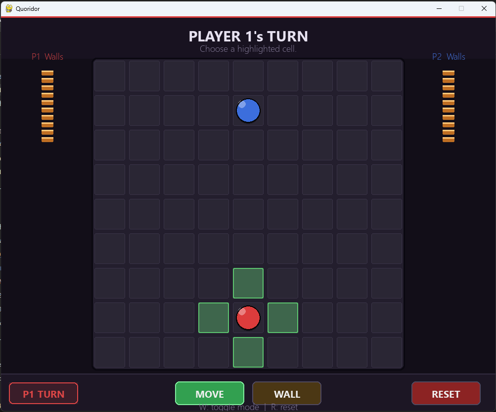

# Quoridor — Pygame Edition

> A digital implementation of the classic abstract strategy board game, built with Python and Pygame.

---

## 🎮 Game Description

**Quoridor** is a two-player strategy board game played on a 9×9 grid. Each player controls a pawn and the goal is simple: **be the first to reach the opposite side of the board**.

On each turn, a player may either:
- **Move** their pawn one step (or jump over the opponent), or
- **Place a wall** to block or redirect the opponent's path.

The twist: walls must never completely seal off a player's path to their goal — there must always be a way through. This creates a deep tactical puzzle of blocking, redirecting, and outmaneuvering your opponent.

This implementation features:
- 🧑‍🤝‍🧑 **Human vs Human** local multiplayer
- 🤖 **Human vs Computer** with three AI difficulty levels (Easy, Medium, Hard)
- ↩️ **Undo / Redo** support
- 🎨 A polished dark-themed UI with animated highlights and ghost wall previews

---

## 📸 Screenshots

### Main Menu


### Difficulty Selection


### Gameplay — Player 1's Turn


### Move Highlighting


### Wall Placement


### Human vs Human — Mid Game


---

## 🛠️ Installation & Running Instructions

### Requirements

- Python **3.8+**
- Pygame **2.x**

### Install Dependencies

```bash
pip install pygame
```

### Project Structure

```
quoridor/
├── main.py
├── game/
│   ├── board.py
│   ├── pawn.py
│   ├── wall.py
│   ├── pathfinder.py
│   └── game_manager.py
├── ai/
│   ├── ai_player.py
│   ├── ai_easy.py
│   ├── ai_medium.py
│   └── ai_hard.py
└── ui/
    ├── renderer.py
    ├── event_handler.py
    ├── hud.py
    ├── menus.py
    └── constants.py
```

### Run the Game

```bash
python main.py
```

---

## 🕹️ Controls

| Action | Control |
|---|---|
| **Select your pawn** | Left-click on your pawn |
| **Move pawn** | Left-click a highlighted (green) cell |
| **Switch to Wall mode** | Press `W` or click the **WALL** button |
| **Place a wall** | Left-click a gap between cells in Wall mode |
| **Switch to Move mode** | Press `W` again or click the **MOVE** button |
| **Undo last move** | Press `U` |
| **Redo last undone move** | Press `P` |
| **Reset game** | Press `R` or click the **RESET** button |

### AI Difficulty Levels

| Level | Strategy |
|---|---|
| **Easy** | Greedy BFS — always moves toward the goal |
| **Medium** | Minimax search (depth 3) with wall candidates |
| **Hard** | Iterative-deepening Alpha-Beta pruning (depth up to 5, 2s time budget) |

---

## 🎬 Demo Video

▶️ [Watch the demo on YouTube](https://drive.google.com/drive/folders/17x9fiqaWNOA9ZMfs_MOQA3saO11upBoO)


---

## 📋 Notes

- Walls are two cells wide and must be placed in the gaps between cells.
- A wall placement is **illegal** if it completely cuts off either player from their goal row.
- In **Human vs Computer** mode, Undo reverts both your move and the AI's response in one step.
- Each player starts with **10 walls**.
